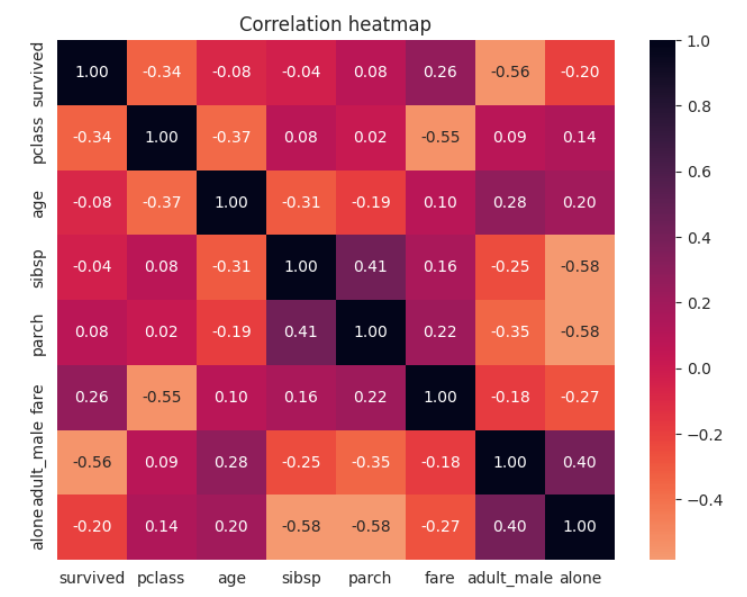
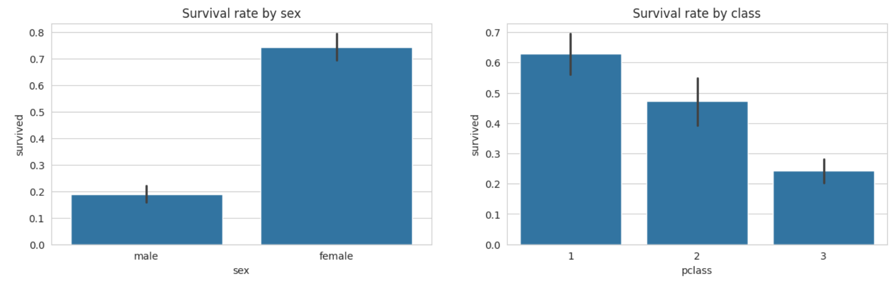
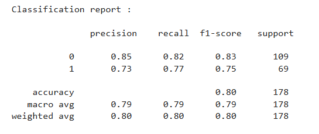

# 🚢 Titanic Survival Prediction using Logistic Regression

A Machine Learning classification project that predicts whether a passenger survived the Titanic disaster using **Logistic Regression**. This project demonstrates the complete machine learning workflow, including data preprocessing, exploratory data analysis (EDA), feature engineering, model training, and evaluation.

---

# 📌 Project Overview

The objective of this project is to predict whether a passenger survived the Titanic disaster based on passenger information.

**Target Variable**

- **0** → Did Not Survive
- **1** → Survived

---

# 📂 Dataset

Dataset Source: Seaborn Titanic Dataset

The dataset contains passenger information such as:

- Passenger Class
- Sex
- Age
- Fare
- Number of Siblings/Spouses
- Number of Parents/Children
- Embarked Port
- Adult male

---

# 🔍 Exploratory Data Analysis

Performed detailed exploratory data analysis including:

- Missing Value Analysis
- Distribution of Numerical Features
- Correlation Heatmap
- Survival Rate by Gender
- Survival Rate by Passenger Class
- Survival Rate by Family Size
- Feature Relationship Analysis

---

# 📊 Visualizations

## Correlation Heatmap



---

## Survival Rate by Sex and Survival Rate by Class



---

# ⚙️ Feature Engineering

Created a new feature:

```python
Family Size = SibSp + Parch + 1
```

This represents the total number of family members travelling together.

---

# 🛠 Data Preprocessing

- Handled missing values
- Encoded categorical variables
- Feature Engineering
- Train-Test Split

---

# 🤖 Model Used

- Logistic Regression

---

# 📈 Model Performance

| Metric | Score |
|---------|-------|
| Accuracy | **79.8%** |


### Evaluation Metrics

- Accuracy Score
- Confusion Matrix
- Precision
- Recall
- F1-Score
- Classification Report

### Classification Report




---

# 🛠 Technologies Used

- Python
- Pandas
- NumPy
- Matplotlib
- Seaborn
- Scikit-learn
- Google Colab
---

# 📁 Project Structure

```
Titanic-Survival-Prediction/
│
├── data/
│   └── titanic-dataset.csv
│
├── images/
│   ├── classification-report.png
│   ├── correlation-heatmap.png
│   └── survival-rate-by-sex and survival-rate-by-class.png
│
├── .gitignore
├── README.md
└── titanic-survival-predictor.ipynb
```

---

# 🚀 Key Learnings

- Data Cleaning
- Exploratory Data Analysis (EDA)
- Feature Engineering
- Data Visualization
- Logistic Regression
- Binary Classification
- Model Evaluation
- Machine Learning Pipeline

---

# 🔮 Future Improvements

- Feature Scaling
- ROC Curve & AUC Score
- Cross Validation
- Hyperparameter Tuning
- Compare Multiple Classification Models
- Streamlit Deployment

---

# 👩‍💻 Author

**Palak Mallik**

GitHub: https://github.com/PalakMallik

LinkedIn: https://www.linkedin.com/in/palak-mallik/

---

⭐ If you found this project useful, consider giving it a star!
